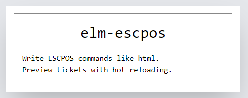

## Quickstart
```elm
import Escpos exposing (batch, newline, writeLine)
import Escpos.Attributes exposing (alignCenter, normalDouble)


ticketContents : Escpos.Command
ticketContents =
    batch []
        [ batch [ alignCenter, normalDouble]
            [ writeLine "elm-escpos" ]
        , newline
        , writeLine "Write ESCPOS commands like html."
        , writeLine "Preview tickets with hot reloading."
        ]
```

## Previewing tickets
I've included an app to be able to preview the tickets as you code them.

Check out the docs at [tickets-preview](tickets-preview) for instructions on how to run and use it.


Here is what that one looks like after printing.


## Printing
This is printer specific, but you will generally need to encode the command somehow 
and then send it to the printer through http or via ports if you need js.

The library includes encode functions for `Bytes`, `List Int` and `Json.Encode.Value`.

The preview app has an example for printing via ports and USB connection. 
Check out [TicketPreview.elm](tickets-preview/src/TicketPreview.elm) if you need the details, the gist of it is:

1. Build your ticket contents

```elm
ticketContents : Escpos.Command
ticketContents =
    batch []
        [ batch [ alignCenter, normalDouble]
            [ writeLine "elm-escpos" ]
        , newline
        , writeLine "Write ESCPOS commands like html."
        , writeLine "Preview tickets with hot reloading."
        ]
```

2. Make a function with whatever commands your printer needs.

```elm
buildPrintCommand : Escpos.Command -> Escpos.Command
buildPrintCommand contentsCommand =
    batch []
        [ initialize
        , contentsCommand

        -- These two newlines add some padding so content is not cut in half
        -- It is not built-in because I think it is printer specific
        , batch [] (List.repeat 2 newline)
        , cut
        ]
```

3. Encode and send through a port

```elm
port connectAndPrint : List Int -> Cmd msg

sendToPrinter : Escpos.Command -> Cmd msg
sendToPrinter command =
    command
    |> buildPrintCommand
    |> Escpos.encodeAsInts
    |> connectAndPrint
```

4. Handle the port in js land 

```typescript
app.ports.connectAndPrint.subscribe(async (ints: Array<number>) => {
        console.info("Connect & Print", ints)

        // Ask user for printer
        const selectedDevice: USBDevice = await navigator.usb.requestDevice({
            filters: []
        })

        // Setup
        await selectedDevice.open()
        await selectedDevice.selectConfiguration(1)
        await selectedDevice.claimInterface(0)

        // Send to printer
        const uintsArray = new Uint8Array(ints)
        selectedDevice.transferOut(1, uintsArray)
    }
)
```